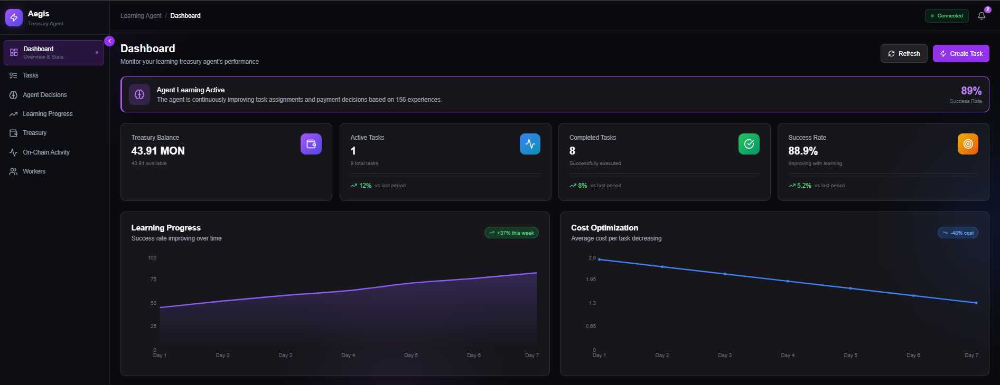

# 🏦 Autonomous Treasury Agent

> **"Multi-Agent AI. Real-time decisions. True autonomy."**

A competition-ready **multi-agent AI treasury system** on **Monad Testnet** with agent-to-agent transactions, GPT-4 reasoning, and nad.fun token integration. Built for the Monad hackathon.


## 🎯 Competition Features

✅ **Agent-to-Agent Interaction** - Multiple agents negotiate, bid, and transact  
✅ **nad.fun Token Launch** - ATAI token with governance & revenue sharing  
✅ **Real LLM Integration** - GPT-4/Claude for intelligent reasoning  
✅ **Wallet Connect** - MetaMask integration, create tasks from UI  
✅ **Monad Testnet Deployed** - Live on actual testnet  
✅ **Envio Indexing** - GraphQL API for fast on-chain data  

## 📸 Dashboard Preview


*Real-time multi-agent autonomous activity with AI reasoning*

---

## 🌟 What Makes This Special

### 1. Multi-Agent Marketplace 🤝

Multiple autonomous agents with different personalities compete for tasks:
- **Aggressive agents** bid low for speed
- **Conservative agents** bid high for reliability
- **Collaborative agents** negotiate prices
- **Opportunistic agents** use market dynamics

Agents negotiate directly, build reputation, and transact peer-to-peer.

### 2. Hybrid AI System 🧠

Combines traditional ML with modern LLMs:
- **UCB1 Bandit** for exploration/exploitation
- **GPT-4** for task analysis and reasoning
- **Claude** for verification (optional)
- **Explainable decisions** with full reasoning chains

### 3. Token Economics 🪙

**$ATAI Token** features:
- Revenue sharing (2.5% of fees → holders)
- Staking (5% APY)
- Governance (vote on agent parameters)
- Listed on nad.fun platform

### 4. Production Ready 🚀

- Deployed on Monad testnet
- Envio indexer for fast queries
- MetaMask integration
- Real-time WebSocket updates
- Comprehensive monitoring

---

## 🏗️ Architecture

```
┌──────────────────────────────────────────────────────────────────┐
│                    FRONTEND (React + Vite)                        │
│   Dashboard • Tasks • Workers • Learning • Agents • Token UI     │
│              ⚡ MetaMask Integration • Wallet Connect             │
└──────────────────────────────────────────────────────────────────┘
                              │
                    ┌─────────┴─────────┐
                    ▼                   ▼
┌─────────────────────────────┐  ┌──────────────────────────┐
│   ENVIO INDEXER (GraphQL)   │  │    API SERVER (Python)   │
│   • Fast queries            │  │    • Agent coordination   │
│   • Real-time events        │  │    • WebSocket updates    │
└─────────────────────────────┘  └──────────────────────────┘
                    │                   │
                    └─────────┬─────────┘
                              ▼
┌──────────────────────────────────────────────────────────────────┐
│              MULTI-AGENT SYSTEM (Python)                          │
│  ┌───────────────┐  ┌────────────┐  ┌──────────────────────┐    │
│  │  Coordinator  │  │ AI Reasoner│  │  Agent Orchestrator  │    │
│  │  (UCB1 MAB)   │  │ (GPT-4/LLM)│  │  (Multi-Agent Mgmt)  │    │
│  └───────────────┘  └────────────┘  └──────────────────────┘    │
│                                                                   │
│  ┌─────────┐  ┌─────────┐  ┌─────────┐  ┌─────────┐            │
│  │ Agent 1 │  │ Agent 2 │  │ Agent 3 │  │ Agent N │            │
│  │Aggressive│  │Conserv. │  │ Collab. │  │ Dynamic │            │
│  └─────────┘  └─────────┘  └─────────┘  └─────────┘            │
└──────────────────────────────────────────────────────────────────┘
                              │
                              ▼
┌──────────────────────────────────────────────────────────────────┐
│                       MONAD TESTNET                               │
│  ┌──────────┐  ┌──────────────┐  ┌───────────────┐              │
│  │ Treasury │  │ TaskRegistry │  │ WorkerRegistry│              │
│  │ (Funds)  │  │ (Lifecycle)  │  │   (Stats)     │              │
│  └──────────┘  └──────────────┘  └───────────────┘              │
│                                                                   │
│  ┌──────────────────┐  ┌─────────────────┐                      │
│  │ AgentMarketplace │  │   AgentToken    │                      │
│  │ (Bidding/Nego)   │  │ (nad.fun/ERC20) │                      │
│  └──────────────────┘  └─────────────────┘                      │
└──────────────────────────────────────────────────────────────────┘
```

---

## 🚀 Quick Start

### Option 1: Automated Setup (Recommended)

```bash
# Run setup script
python setup.py

# Follow the prompts to:
# - Generate agent wallets
# - Create .env configuration
# - Check dependencies
```

### Option 2: Manual Setup

See [DEPLOYMENT_GUIDE.md](./DEPLOYMENT_GUIDE.md) for complete step-by-step instructions.

### Quick Deploy to Testnet

```bash
# 1. Get testnet MON
Visit https://faucet.monad.xyz

# 2. Configure .env
cp .env.example .env
# Add your private keys and API keys

# 3. Deploy contracts
cd contracts
npm install
npx hardhat run scripts/deploy_testnet.js --network monad-testnet

# 4. Start agent system
cd agent
pip install -r requirements.txt
python main.py

# 5. Launch frontend
cd frontend
npm install
npm run dev
```

Visit http://localhost:5173 and connect your MetaMask! 🎉

---

## 📦 Project Structure

```
Autonomous Treasury Agent/
├── contracts/                    # Solidity smart contracts
│   ├── src/
│   │   ├── Treasury.sol               # Fund management & rules
│   │   ├── TaskRegistry.sol           # Task lifecycle (Gasless)
│   │   ├── WorkerRegistry.sol         # Worker management
│   │   ├── AgentMarketplace.sol       # 🆕 Agent bidding & negotiation
│   │   ├── AgentToken.sol             # 🆕 ERC20 token (nad.fun)
│   │   ├── MinimalForwarder.sol       # EIP-2771 Relayer
│   │   └── interfaces/                # Contract interfaces
│   ├── scripts/
│   │   ├── deploy.js                  # Local deployment
│   │   ├── deploy_testnet.js          # 🆕 Monad testnet deployment
│   │   └── deploy_token.js            # 🆕 Token deployment
│   └── hardhat.config.js              # Monad network config
│
├── agent/                        # Python AI Agent System
│   ├── coordinator.py                 # Main coordinator agent
│   ├── learner.py                     # UCB1 + payment optimizer
│   ├── multi_agent.py                 # 🆕 Multi-agent system
│   ├── ai_reasoning.py                # 🆕 GPT-4/Claude integration
│   ├── nad_fun.py                     # 🆕 nad.fun platform API
│   ├── indexer.py                     # 🆕 Envio integration
│   ├── blockchain.py                  # Web3 interactions
│   ├── memory.py                      # Persistent learning state
│   ├── main.py                        # Agent + API server
│   └── requirements.txt               # Python dependencies
│
├── frontend/                     # React Frontend
│   ├── src/
│   │   ├── components/
│   │   │   ├── WalletButton.tsx       # 🆕 MetaMask connection
│   │   │   ├── Layout.tsx             # Updated with wallet
│   │   │   └── ...                    # Other components
│   │   ├── lib/
│   │   │   ├── wallet.ts              # 🆕 Wallet management
│   │   │   ├── walletHooks.ts         # 🆕 React hooks
│   │   │   ├── blockchain.ts          # Contract interactions
│   │   │   └── ...
│   │   └── pages/                     # Dashboard pages
│   └── package.json
│
├── indexer/                      # 🆕 Envio Indexer
│   ├── envio.yaml                     # Indexer configuration
│   ├── README.md                      # Setup guide
│   └── src/                           # Event handlers
│
├── DEPLOYMENT_GUIDE.md           # 🆕 Complete deployment guide
├── NEW_FEATURES.md               # 🆕 Feature overview
├── setup.py                      # 🆕 Automated setup script
├── .env.example                  # Environment template
└── README.md                     # This file
```

---

## ⭐ Key Features

### 1. 🤝 Multi-Agent Marketplace

**What**: Multiple autonomous agents compete for tasks through bidding and negotiation

**How**:
- Agents register with unique personalities (Aggressive, Conservative, Collaborative, Opportunistic)
- Submit competitive bids on tasks
- Negotiate prices with each other
- Build reputation based on performance
- Transact peer-to-peer

**Code Example**:
```python
from multi_agent import MultiAgentOrchestrator, AgentPersonality

# Create 3 competing agents
orchestrator = MultiAgentOrchestrator(marketplace_address)

agent1 = orchestrator.create_agent(
    name="SpeedyBidder",
    personality=AgentPersonality.AGGRESSIVE,  # Bids low, acts fast
    capabilities=[TaskType.DATA_PROCESSING]
)

agent2 = orchestrator.create_agent(
    name="ReliableWorker", 
    personality=AgentPersonality.CONSERVATIVE,  # Bids high, very reliable
    capabilities=[TaskType.VERIFICATION]
)

# Watch them compete!
await orchestrator.start()
```

**Smart Contract**: `AgentMarketplace.sol` - 400+ lines of Solidity for agent coordination

---

### 2. 🧠 Hybrid AI System

**What**: Combines traditional ML (UCB1) with modern LLMs (GPT-4/Claude)

**UCB1 Multi-Armed Bandit**:
- Balances exploration vs exploitation
- Learns optimal worker selection
- Adapts payment strategies

**LLM Reasoning**:
```python
from ai_reasoning import AIReasoner

ai = AIReasoner(provider="openai", model="gpt-4o-mini")

# AI analyzes task complexity
analysis = await ai.analyze_task(task)
# Returns: complexity, required_skills, estimated_time, risk_level, reasoning

# AI matches workers to tasks
score, reasoning = await ai.assess_worker_match(task, worker, history)
# Returns: 0.0-1.0 match score with full explanation

# AI verifies completion
is_valid, reasoning, confidence = await ai.verify_task_completion(
    task, outcome, submission
)
```

**Why Both**: UCB1 for fast decisions, LLM for complex reasoning. Best of both worlds.

---

### 3. 🪙 $ATAI Token on nad.fun

**What**: ERC20 governance token with revenue sharing, staking, and voting

**Tokenomics**:
- **Total Supply**: 1,000,000 ATAI
- **Revenue Share**: 2.5% of all task fees → token holders
- **Staking APY**: 5% annual return
- **Governance**: Vote on agent parameters

**Distribution**:
- 40% Public sale
- 20% Liquidity pool
- 15% Team (vested)
- 10% Treasury
- 10% Staking rewards
- 5% Community airdrop

**Smart Contract Features**:
```solidity
// Automatic revenue distribution
function distributeRevenue() external payable {
    revenuePerToken += (msg.value * 1e18) / totalSupply;
}

// Stake tokens for rewards
function stake(uint256 amount) external {
    stakedBalance[msg.sender] += amount;
    // Earns 5% APY + voting power
}

// Vote on governance proposals
function vote(uint256 proposalId, bool support) external {
    uint256 weight = balanceOf[msg.sender] + stakedBalance[msg.sender];
    // Token-weighted voting
}
```

**nad.fun Integration**: 
- Listed on nad.fun platform
- Liquidity pools
- Price tracking
- Agent leaderboard

---

### 4. 💼 Wallet Connect (MetaMask)

**What**: Full Web3 wallet integration in frontend

**User Actions**:
- Connect wallet with one click
- Create tasks directly from UI
- Register as worker
- Submit bids on marketplace
- Stake tokens
- Vote on proposals

**Implementation**:
```typescript
// Frontend wallet integration
import { useWallet, useCreateTask } from './lib/walletHooks';

function CreateTaskButton() {
  const { connect, isConnected } = useWallet();
  const { createTask } = useCreateTask();

  const handleCreate = async () => {
    await createTask(
      taskRegistryAddress,
      TaskType.DATA_PROCESSING,
      "Analyze user data",
      "0.5",  // 0.5 MON reward
      3600    // 1 hour
    );
  };

  return isConnected ? (
    <button onClick={handleCreate}>Create Task</button>
  ) : (
    <button onClick={connect}>Connect Wallet</button>
  );
}
```

**Network Switching**: Automatic prompt to switch to Monad testnet

---

### 5. 🚀 Monad Testnet Deployment

**What**: Full system deployed to Monad testnet (not just localhost)

**Deployment Script**:
```bash
npx hardhat run scripts/deploy_testnet.js --network monad-testnet
```

**Deploys**:
1. MinimalForwarder (meta-transactions)
2. Treasury (fund management)
3. WorkerRegistry (worker tracking)
4. TaskRegistry (task lifecycle)
5. AgentMarketplace (agent coordination)
6. AgentToken (nad.fun token)

**Live Contracts**: View on https://testnet.monadvision.com

**Benefits**:
- Real blockchain interaction
- Live demos for judges
- Actual gas optimization
- Production environment

---

### 6. 📊 Envio Indexer (GraphQL)

**What**: Professional-grade blockchain indexer for fast queries

**GraphQL API**:
```graphql
# Get active tasks
query {
  tasks(where: { status: "Open" }, limit: 10) {
    id taskId creator reward assignedWorker
  }
}

# Get top workers by reliability
query {
  workers(orderBy: reliabilityScore, orderDirection: desc) {
    address reliabilityScore completedTasks
  }
}

# Get agent marketplace bids
query {
  bids(where: { taskId: 123 }) {
    bidId bidder proposedPrice proposal status
  }
}

# Get system statistics
query {
  statistics {
    totalTasks totalWorkers totalVolume
  }
}
```

**Performance**:
- Query latency: <50ms (vs 1-5s polling)
- Real-time event subscriptions
- Complex aggregations
- Historical analysis

**Python Integration**:
```python
from indexer import get_indexer

indexer = get_indexer()
tasks = indexer.get_tasks(status="Open", limit=10)
workers = indexer.get_workers(active_only=True)
stats = indexer.get_statistics()
```

---

## 🎯 Use Cases

### For DAOs
- Automate treasury management
- Reduce governance overhead
- Data-driven fund allocation
- Transparent decision-making

### For Task Platforms
- Intelligent worker matching
- Dynamic pricing
- Reputation-based selection
- Automated quality control

### For Multi-Agent Systems
- Agent coordination protocols
- Competitive marketplaces
- Reputation systems
- P2P transactions

---

## 🌐 Monad Testnet Configuration

| Setting | Value |
|---------|-------|
| **Network Name** | Monad Testnet |
| **RPC URL** | `https://testnet-rpc.monad.xyz` |
| **Chain ID** | `10143` |
| **Currency** | MON |
| **Block Explorer** | `https://testnet.monadvision.com` |
| **Faucet** | `https://testnet.monad.xyz` |

### Add to MetaMask

1. Open MetaMask → Networks → Add Network
2. Enter the details above
3. Save and switch to Monad Testnet

---

## 🧠 Learning Algorithm

### Multi-Armed Bandit (UCB1)

The agent balances **exploration** (trying uncertain workers) with **exploitation** (using known good workers):

```
UCB1 Score = average_reward + c × √(ln(total_pulls) / worker_pulls)
```

- **Higher c**: More exploration
- **Exploration decays**: Over time, agent exploits learned knowledge
- **Reward signal**: `success ? (value - cost) : -cost`

### Payment Optimization

Uses gradient descent to learn optimal payment amounts:

```python
# If task succeeded with lower payment, learn to pay less
# If task failed, learn the minimum payment needed
optimal_payment = reliability_score × max_payment × learned_multiplier
```

---

## 🔐 Security Model

| Attack Vector | Protection |
|--------------|------------|
| Agent steals funds | **Impossible** - Agent has no wallet access |
| Agent overspends | **Contract limits** - Max per task/day enforced |
| Agent picks bad worker | **Worker registry** - Only whitelisted workers |
| Task fails | **Automatic unlock** - Reserved funds returned |
| Hidden actions | **Full audit log** - All actions on-chain |

### The Core Principle

```solidity
// Agent CANNOT do this:
payable(worker).transfer(amount);  // ❌ No direct access

// Agent CAN do this:
taskRegistry.proposeAssignment(taskId, worker, payment);  // ✅ Proposal only
// Contract then enforces rules and conditionally releases funds
```

---

## � Documentation

- **[DEPLOYMENT_GUIDE.md](./DEPLOYMENT_GUIDE.md)** - Complete step-by-step deployment
- **[NEW_FEATURES.md](./NEW_FEATURES.md)** - Feature overview and comparisons
- **[indexer/README.md](./indexer/README.md)** - Envio indexer setup
- **[DEMO_WALKTHROUGH.md](./DEMO_WALKTHROUGH.md)** - Live demo script

---

## 🛠️ API Endpoints

The agent exposes a REST API for the dashboard:

| Endpoint | Description |
|----------|-------------|
| `GET /api/health` | System health check |
| `GET /api/status` | Full agent status |
| `GET /api/treasury` | Treasury details |
| `GET /api/tasks` | List all tasks |
| `GET /api/workers` | List all workers |
| `GET /api/agents` | 🆕 Agent marketplace stats |
| `GET /api/bids` | 🆕 Current bids |
| `GET /api/token` | 🆕 Token statistics |
| `GET /api/metrics` | Performance metrics |
| `GET /api/learning` | Learning statistics |

---

## 🏆 Competition Checklist

Before submission:

- [ ] All contracts deployed to Monad testnet
- [ ] Agent token registered on nad.fun
- [ ] Multi-agent system running (3+ agents)
- [ ] AI reasoning enabled (GPT-4 or Claude)
- [ ] Wallet Connect working in frontend
- [ ] Envio indexer syncing data
- [ ] Demo video recorded (2-3 minutes)
- [ ] GitHub repo public
- [ ] README comprehensive
- [ ] Submission form completed

---

## 🚀 Next Steps

1. **Run Setup**: `python setup.py`
2. **Deploy to Testnet**: Follow [DEPLOYMENT_GUIDE.md](./DEPLOYMENT_GUIDE.md)
3. **Launch Token**: Register on nad.fun
4. **Record Demo**: Show all features
5. **Submit**: Enter the competition!

---

## 🎥 Demo Script

**30 seconds**: Problem statement
**60 seconds**: Live demo of agent-to-agent bidding
**30 seconds**: Show AI reasoning
**30 seconds**: Wallet interaction + token

Total: 2.5 minutes

See [DEMO_WALKTHROUGH.md](./DEMO_WALKTHROUGH.md) for full script.

---

## 🤝 Contributing

We welcome contributions! Areas for improvement:

- Additional agent personalities
- More LLM providers
- Enhanced verification logic
- UI/UX improvements
- Testing and documentation

---

## 📄 License

MIT License - see LICENSE file for details.

---

## 🙏 Acknowledgments

- **Monad Labs** - Testnet infrastructure and support
- **OpenZeppelin** - Secure contract patterns
- **Hardhat** - Development tooling
- **Envio** - Blockchain indexing
- **OpenAI & Anthropic** - AI reasoning capabilities
- **nad.fun** - Token launch platform

---

## 💬 Support & Links

- **GitHub**: [Your Repository]
- **Discord**: [Your Discord]
- **Twitter**: [Your Twitter]
- **Email**: support@your-project.com

- **Monad Explorer**: https://testnet.monadvision.com
- **Monad Faucet**: https://faucet.monad.xyz
- **nad.fun Platform**: https://nad.fun

---

<p align="center">
  <strong>"Multi-Agent AI. Real-time Decisions. True Autonomy."</strong><br/>
  <em>Built for the Monad hackathon 🚀</em>
</p>

<p align="center">
  <a href="./DEPLOYMENT_GUIDE.md">📖 Deployment Guide</a> •
  <a href="./NEW_FEATURES.md">✨ New Features</a> •
  <a href="./DEMO_WALKTHROUGH.md">🎬 Demo Script</a>
</p>
